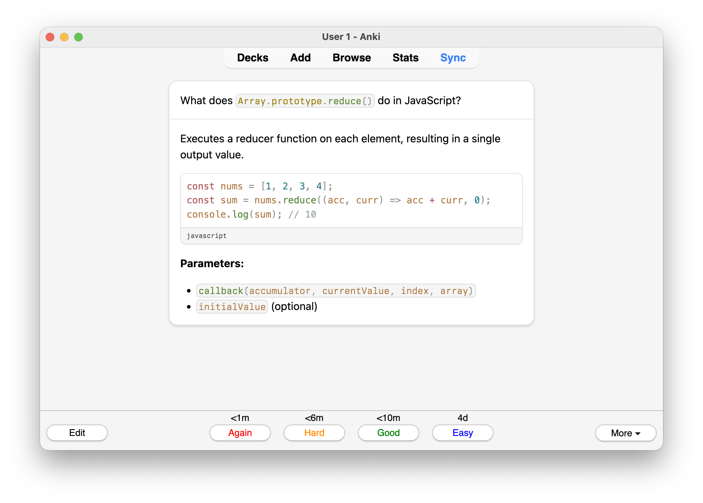

# Anki Markdown

> Anki add-on for Markdown notes with syntax highlighting powered by [Shiki](https://shiki.style)

Write flashcards in Markdown with full [syntax highlighting](docs.md#code-blocks). Pick from 300+ languages and 60+ themes — only your selections are downloaded and synced. Supports light and dark mode across desktop and mobile.

<p align="center">
  <picture>
    <source media="(prefers-color-scheme: dark)" srcset="media/back-dark.png">
    
  </picture>
</p>

> [!NOTE]
> Requires [Anki](https://apps.ankiweb.net/) 25.x or later. Go to `Tools → Add-ons → Get Add-ons` and enter [`1172202975`](https://ankiweb.net/shared/info/1172202975) to install.
> See the [documentation](docs.md) for all supported features.

- **Syntax highlighting** with 300+ languages and 60+ themes, only your selections are downloaded and synced
- **Advanced code annotations** including line highlighting, word highlighting, focus mode, and error/warning markers
- **Full Markdown** with bold, italic, lists, blockquotes, tables, images, alerts, and more
- **Clean card design** with polished light/dark styling that matches Anki's native UI
- **Settings panel** to dynamically pick languages and themes
- **Mobile** works on AnkiDroid and AnkiMobile
- **[AI agent skill](#ai-agent-skill)** built-in skill that lets AI agents create markdown flashcards via [AnkiConnect](https://foosoft.net/projects/anki-connect/)

## Usage

After installing the add-on:

1. **Create a new note** using the **Anki Markdown** note type (Add → Note Type dropdown → Anki Markdown)
2. **Write your question** in the Front field using markdown
3. **Write your answer** in the Back field using markdown
4. The markdown will be automatically rendered with syntax highlighting when you review the card

> [!NOTE]
> See the [documentation](docs.md) for all supported markdown features including code blocks, line highlighting, alerts, and more.

## AI Agent Skill

Markdown is a perfect format for AI-generated content, and this add-on leans into that. It ships with a companion skill that lets AI coding agents (Claude Code, Codex, etc.) create and manage markdown flashcards directly from your editor via [AnkiConnect](https://foosoft.net/projects/anki-connect/). The add-on renders the markdown, the skill creates it.

**Prerequisites:** Anki desktop running with [AnkiConnect](https://foosoft.net/projects/anki-connect/) installed.

Install:

```bash
npx skills add terkelg/anki-markdown -s anki
```

## Settings

Open the settings panel from `Tools → Add-ons → Anki Markdown → Config`.

- **Languages** — pick which languages are available for syntax highlighting. New languages are downloaded on save. Use the filter and "Selected only" toggle to manage your list.
- **Theme** — choose separate Shiki themes for light and dark mode.
- **UI** — toggle cardless mode for a borderless card design.

## Development

See [development.md](development.md) for build, test, and release instructions.
